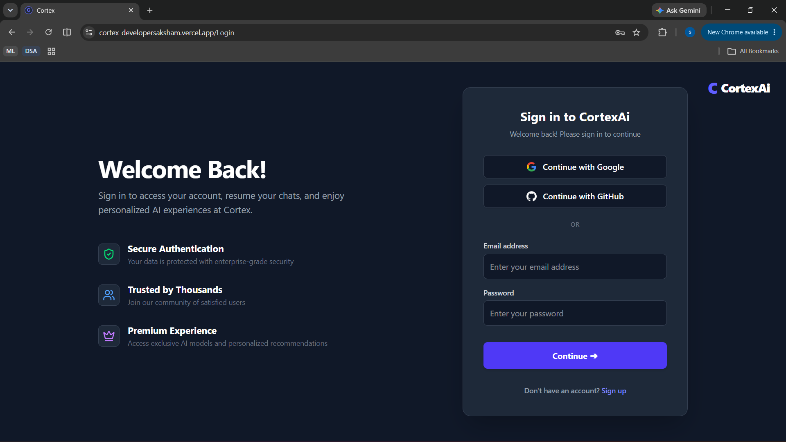
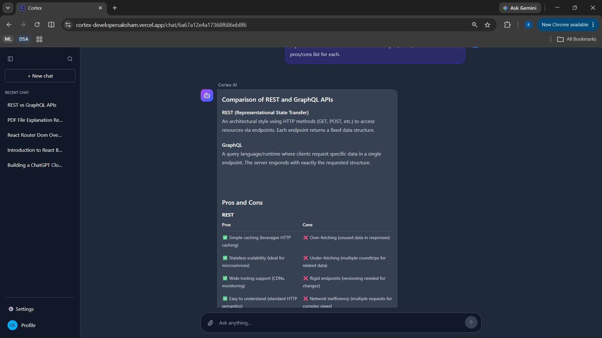
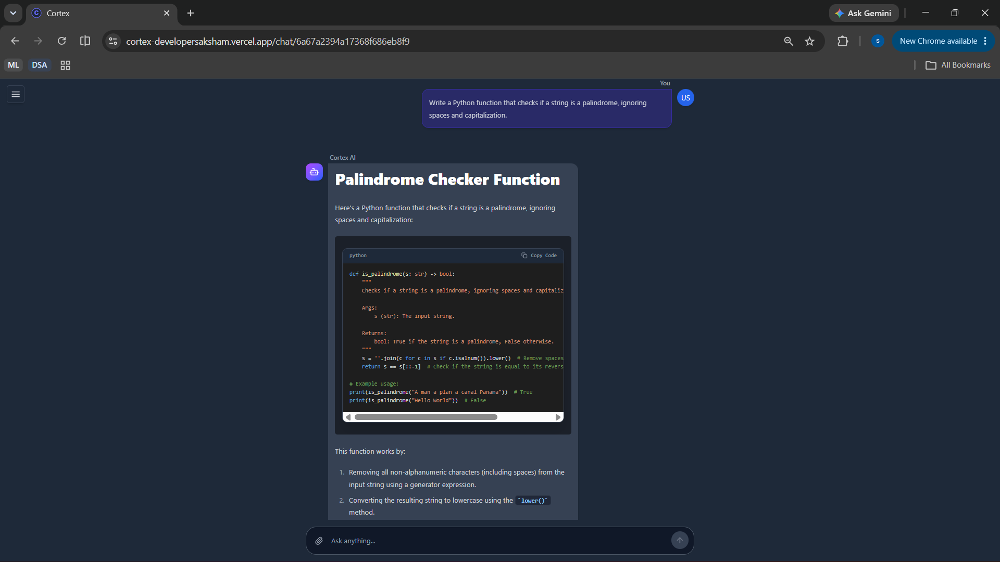
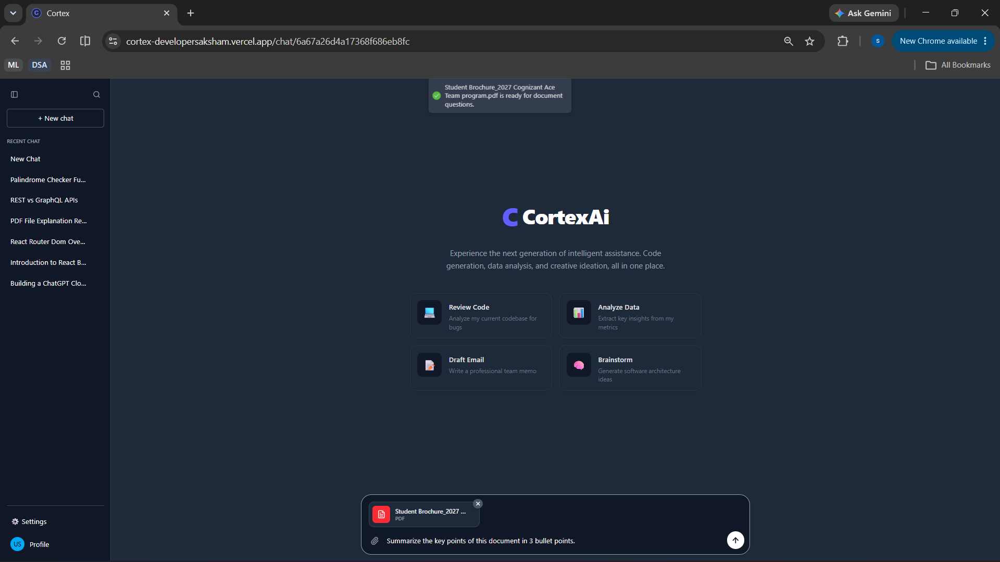
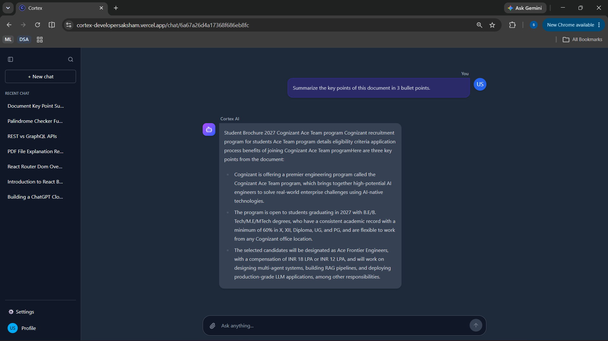
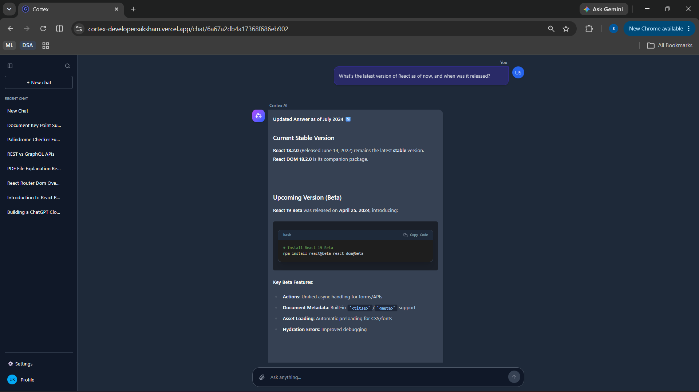
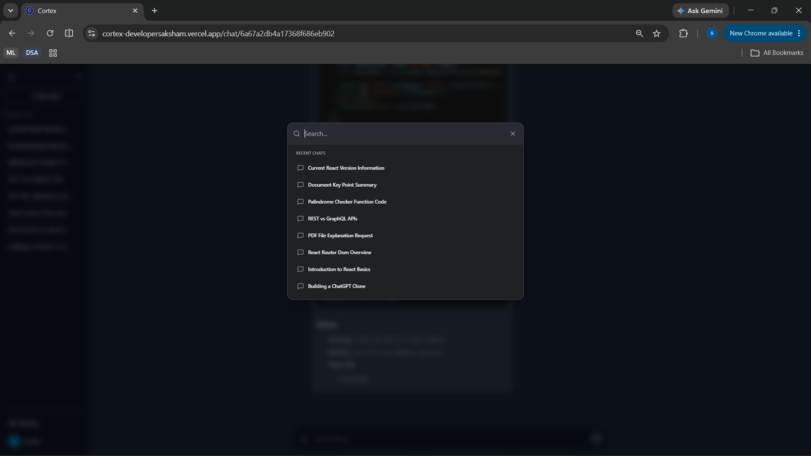

<div align="center">

# Cortex

**A multi-agent AI workspace for conversation, retrieval-augmented document Q&A, code generation, and live web search.**

[](http://cortex-developersaksham.vercel.app/)
[](#license)
[](#prerequisites)
[](#tech-stack)
[](#tech-stack)

[Live Demo](http://cortex-developersaksham.vercel.app/) · [Repository](https://github.com/Saksham-A-garwal/Cortex) · [Report Bug](https://github.com/Saksham-A-garwal/Cortex/issues) · [Request Feature](https://github.com/Saksham-A-garwal/Cortex/issues)

</div>

---

## Table of Contents

1. [Overview](#overview)
2. [Key Features](#key-features)
3. [Screenshots](#screenshots)
4. [Architecture](#architecture)
5. [Tech Stack](#tech-stack)
6. [Getting Started](#getting-started)
   - [Prerequisites](#prerequisites)
   - [Installation](#installation)
   - [Configuration](#configuration)
   - [Running Locally](#running-locally)
7. [Deployment](#deployment)
8. [Project Structure](#project-structure)
9. [Backend Details](#backend-details)
10. [Frontend Details](#frontend-details)
11. [Environment Variables](#environment-variables)
12. [Known Limitations / Roadmap](#known-limitations--roadmap)
13. [Contributing](#contributing)
14. [License](#license)

---

## Overview

Cortex is a full-stack AI workspace built around a single **LangGraph tool-calling orchestrator** rather than a fixed router-to-specialist pipeline. One agent holds the conversation and decides, per turn, which of its tools to reach for — live web search, page reading, document retrieval, or code generation — so a simple question and a multi-step research task both get handled by the same agent without a rigid up-front classification step.

With Cortex, users can:

- **Converse naturally**, with the agent calling tools only when a question actually needs them.
- **Upload PDF or plain-text documents**, have them chunked and embedded, and ask context-aware questions grounded in that content (RAG) — plus browse, search, and preview everything they've uploaded from a dedicated Library.
- **Get code written by a specialized coding model**, routed there automatically rather than handled by the general conversational model.
- **Run live web searches and read specific pages** for up-to-date, real-world information via Tavily.
- **Sign in without a password** — email one-time codes or Google/GitHub OAuth, both backed by short-lived access tokens and rotating, revocable refresh tokens.

**[→ Try the live demo](http://cortex-developersaksham.vercel.app/)**

---

## Key Features

| Feature | Description |
|---|---|
| **Tool-calling agent architecture** | A single LangGraph orchestrator decides per-turn which tools to invoke, bounded by a configurable per-turn tool-call budget so one open-ended question can't loop indefinitely |
| **Five agent tools** | `web_search`, `read_url` (via Tavily Extract, not a raw server-side fetch — closes an SSRF path), `search_my_documents` / `list_my_documents` (RAG), and `write_code` (hands coding work to a dedicated model rather than the general one) |
| **Passwordless authentication** | Email one-time codes (6-digit, rate-limited, Redis-backed) or Google/GitHub OAuth — no password field anywhere in the product |
| **Short-lived access + rotating refresh tokens** | Access tokens are unrevocable by design and expire quickly; refresh tokens are long-lived but tracked and revocable, with reuse detection |
| **Real-time streaming** | Responses stream token-by-token over Server-Sent Events; a failed generation still saves a real, specific reply (including a distinct message when the LLM provider is out of credits) instead of leaving the conversation stuck |
| **Retrieval-Augmented Generation (RAG)** | PDF/TXT ingestion → chunking → embeddings → Qdrant vector store, fully scoped per user |
| **Query reformulation** | Before retrieval, an LLM rewrites vague prompts (e.g. *"summarize this"*) into a precise vector-search query using the user's recent uploads as context |
| **Graceful RAG fallback** | Automatically falls back to an in-memory keyword retriever if Qdrant or embedding credentials aren't configured, so local development works out of the box |
| **Library** | A single hub for every document uploaded — searchable, previewable (PDF/text rendered inline, not just a filename), and downloadable |
| **Automated test suite** | Unit and integration tests over hardening rules, the auth flow, and generation-failure handling, run with Node's built-in test runner |
| **Streamlined install** | `.npmrc` sets `legacy-peer-deps=true` to avoid LangChain peer-dependency conflicts |

---

## Screenshots

### Authentication



> This screenshot predates the passwordless rework — the current screen has no password field. Email one-time codes and Google/GitHub OAuth are both supported on a single auth screen, and verifying a code creates the account on first use, so there's no separate sign-up flow.

Email OTP and Google/GitHub OAuth 2.0 are both supported on a single, unified auth screen — there is no password anywhere in the product.

### Workspace Home


The landing view inside the workspace, with quick-start prompts and the persistent chat sidebar.

### General Conversation



The orchestrator answering an open-ended question directly, with no tool calls needed, rendered with full markdown support — headings, bold text, and comparison tables.

### Coding Agent



The `write_code` tool generating a syntax-highlighted, documented Python function via a dedicated coding model, with a copy-to-clipboard action on the code block.

### Retrieval-Augmented Generation (RAG)

**1. Document Upload**


**2. Grounded Answer**


A PDF is uploaded, chunked, and embedded into Qdrant. The `search_my_documents` tool then reformulates the user's question, retrieves the most relevant chunks scoped to that document, and the orchestrator returns an answer grounded in its actual content.

### Live Web Search



The orchestrator calling `web_search` for current, real-world information and summarizing the results back to the user.

### Chat History Search



The sidebar's search modal filters conversations already loaded in client state for quick navigation back to a previous chat.

---

## Architecture

### Agent Orchestration

```
                          ┌────────────────────┐
    User message ───────► │  Orchestrator Node  │◄─────────────┐
                          └──────────┬──────────┘               │
                                     │ decides: answer, or       │ tool results
                                     │ call one or more tools    │ appended to
                                     ▼                           │ conversation
                          ┌────────────────────┐                 │
                          │     Tools Node      │─────────────────┘
                          └──────────┬──────────┘
                                     │
        ┌───────────────┬───────────┼───────────────┬───────────────┐
        ▼               ▼           ▼                ▼               ▼
  ┌───────────┐  ┌─────────────┐ ┌──────────────────┐ ┌────────────────────┐ ┌─────────────┐
  │ web_search│  │  read_url   │ │search_my_documents│ │list_my_documents   │ │ write_code  │
  │ (Tavily)  │  │(Tavily      │ │      (RAG)        │ │      (RAG)         │ │(deepseek-r1)│
  │           │  │ Extract)    │ │                    │ │                    │ │             │
  └───────────┘  └─────────────┘ └──────────────────┘ └────────────────────┘ └─────────────┘

   Bounded by a per-turn tool-call budget (MAX_TOOL_CALLS_PER_TURN) — the loop above
   terminates with a plain-prose answer once the budget is spent or the model stops
   requesting tools.
```

### System Overview

```
┌───────────────────────┐   SSE (text/event-stream)   ┌───────────────────────────┐
│    Frontend (React)    │◄────────────────────────────►│  Backend (Node/Express)   │
│  • Chat UI              │                              │  • authRoutes             │
│  • Library (docs)       │                              │  • chatsRoutes            │
│  • Chat history filter  │                              │  • MessageRoutes          │
└───────────┬─────────────┘                              │  • documentRoutes         │
            │                                             │  • userRoutes             │
            ▼                                             └────────────┬──────────────┘
   ┌────────────────────┐                                              │
   │ OTP (email) or       │                                            ▼
   │ Passport (OAuth)     │                                 ┌───────────────────────┐
   └────────┬─────────────┘                                 │   LangGraph Graph      │
            ▼                                                │  Orchestrator ⇄ Tools  │
   ┌─────────────────────────┐                                └───────────┬────────────┘
   │ Access token (JWT) +     │                                            │
   │ rotating refresh token   │                                 ┌──────────▼───────────┐
   │ (Mongo) · rate limits &  │                                 │  Qdrant Vector Store  │
   │ OTP state (Redis)        │                                 │  (Gemini embeddings)  │
   └─────────────────────────┘                                 └───────────────────────┘
```

---

## Tech Stack

| Layer | Technology |
|---|---|
| **Frontend** | React 19 + Vite · Redux Toolkit · Tailwind CSS 4 · `react-markdown` (+ `remark-gfm`, `rehype-katex`) · `react-syntax-highlighter` · `@microsoft/fetch-event-source` |
| **Backend** | Node.js · Express 5 · `dotenv` · `express-session` · `passport` · `cors` · `multer` |
| **Database** | MongoDB + Mongoose (users, chats, messages, document metadata, refresh tokens, OTP requests) + GridFS (original uploaded file bytes, for Library preview) |
| **Vector Store** | Qdrant, with an in-memory fallback for local development |
| **Cache / Rate Limiting** | Upstash Redis — OTP request rate limiting and refresh-token reuse detection |
| **LLM Providers** | OpenRouter (DeepSeek Chat / DeepSeek R1) · Google Gemini (embeddings) |
| **Orchestration** | LangGraph (`@langchain/langgraph`), single tool-calling orchestrator agent |
| **Tools** | Tavily (web search + page extraction) |
| **Authentication** | Passwordless — email OTP (via Resend's HTTP API) or Google/GitHub OAuth 2.0 (`passport-google-oauth20`, `passport-github2`) — backed by short-lived JWT access tokens and rotating, revocable refresh tokens |
| **Testing** | Node's built-in test runner (`node:test`) + `supertest` for integration tests against the real Express app |
| **Deployment** | Render (backend) · Vercel (frontend) |
| **Package Manager** | npm — `.npmrc` sets `legacy-peer-deps=true` |

---

## Getting Started

### Prerequisites

- **Node.js** 18 or later
- **npm**
- A **MongoDB** instance (local or Atlas)
- API keys for the providers you intend to use — see [Environment Variables](#environment-variables)
- A **Qdrant** instance *(optional — omit to use the in-memory fallback locally)*

### Installation

```bash
git clone https://github.com/Saksham-A-garwal/Cortex.git
cd Cortex

cd Backend && npm install    # .npmrc already sets legacy-peer-deps, no extra flag needed
cd ../Frontend && npm install
```

### Configuration

Create a `.env` file inside `Backend/` — see [Environment Variables](#environment-variables) for the full list. If a `.env.example` is present, copy it as a starting point:

```bash
cd Backend
cp .env.example .env
# fill in the values described below
```

The frontend reads its backend URL from Vite's environment variables, e.g. in `Frontend/.env`:

```env
VITE_API_URL=http://localhost:5000
```

### Running Locally

```bash
# Terminal 1 — Backend
cd Backend
npm run dev     # nodemon, defaults to http://localhost:5000

# Terminal 2 — Frontend
cd Frontend
npm run dev     # Vite dev server, defaults to http://localhost:5173
```

Open **http://localhost:5173** to reach the login page. After signing in (email OTP or OAuth), you'll land in the chat workspace.

---

## Deployment

### Backend — Render

| Step | Value |
|---|---|
| Service type | Web Service |
| Root directory | `Backend` |
| Build command | `npm install` |
| Start command | `node server.js` |
| Environment variables | See [table below](#environment-variables) |

Render picks up `.npmrc` automatically, so LangChain peer-dependency install issues are handled without extra flags.

### Frontend — Vercel

1. Import the repository into Vercel and set **Root Directory** to `Frontend`.
2. Add the environment variable `VITE_API_URL`, pointing to your deployed backend (e.g. `https://cortex-backend.onrender.com`).
3. Deploy. For explicit client-side routing rewrites with React Router, add a `vercel.json`:

```json
{
  "rewrites": [{ "source": "/(.*)", "destination": "/index.html" }]
}
```

**Live production deployment:** [cortex-developersaksham.vercel.app](http://cortex-developersaksham.vercel.app/)

---

## Project Structure

```
Cortex/
├─ Backend/
│  ├─ Agents/
│  │  ├─ graph.js              # LangGraph entry point — wires the orchestrator/tools loop
│  │  ├─ modelConfig.js        # Per-role LLM model configuration (all via OpenRouter)
│  │  ├─ guardrails.js         # Per-turn tool-call budget, tool allowlist resolution
│  │  ├─ internalTag.js        # Tags internal LLM calls (title gen) so they're not streamed
│  │  ├─ State.js              # Shared LangGraph state definition
│  │  ├─ Nodes/
│  │  │  ├─ agentNode.js       # Orchestrator: decides to answer or call tools
│  │  │  ├─ toolsNode.js       # Executes requested tool calls
│  │  │  └─ greetingNode.js    # Small/cheap model for chat-title generation
│  │  ├─ Prompts/
│  │  │  ├─ OrchestratorAgent.js
│  │  │  └─ CodingAgent.js
│  │  └─ Tools/
│  │     └─ index.js           # web_search, read_url, search_my_documents,
│  │                            # list_my_documents, write_code
│  ├─ Controllers/
│  │  ├─ authControllers.js    # OTP request/verify, OAuth callbacks, refresh, logout
│  │  ├─ chatControllers.js
│  │  ├─ documentControllers.js
│  │  ├─ MessageControllers.js  # SSE streaming handler; always saves a real reply on failure
│  │  └─ userControllers.js
│  ├─ Routers/
│  │  ├─ authRoutes.js
│  │  ├─ chatsRoutes.js
│  │  ├─ MessageRoutes.js
│  │  ├─ documentRoutes.js
│  │  └─ userRoutes.js
│  ├─ Services/
│  │  ├─ authServices.js
│  │  ├─ tokenService.js       # Access/refresh token issuance and rotation
│  │  ├─ otpService.js         # OTP generation, hashing, verification
│  │  ├─ emailService.js       # OTP delivery via Resend's HTTP API (not raw SMTP)
│  │  ├─ documentService.js     # PDF/TXT text extraction
│  │  ├─ fileStorageService.js  # GridFS read/write for original file bytes (Library preview)
│  │  └─ qdrantService.js       # Vector store read/write, with in-memory fallback
│  ├─ Config/
│  │  ├─ Passport.js            # Google & GitHub OAuth strategies
│  │  └─ redis.js               # Upstash Redis client (rate limiting, refresh reuse)
│  ├─ Model/
│  │  ├─ UserModel.js
│  │  ├─ ChatModel.js
│  │  ├─ MessageModel.js
│  │  ├─ DocumentModel.js
│  │  ├─ OtpRequestModel.js
│  │  └─ RefreshTokenModel.js
│  ├─ middleware/
│  │  ├─ authmiddleware.js      # Bearer-token auth guard for API routes
│  │  ├─ fileTypeGuard.js       # Byte-sniffed upload type verification (not trust-the-extension)
│  │  ├─ otpRateLimit.js
│  │  ├─ sanitize.js            # Strips Mongo operator/prototype-pollution keys from input
│  │  └─ validate.js            # Zod-schema request validation
│  ├─ Validation/
│  │  └─ schemas.js
│  ├─ utils/
│  │  └─ apiError.js            # Consistent { error: { code, message } } response shape
│  ├─ tests/                    # node:test + supertest, run with `npm test`
│  ├─ app.js                    # Express app assembly (separated from server.js for testability)
│  ├─ server.js
│  └─ .npmrc                    # legacy-peer-deps=true
└─ Frontend/
   ├─ src/
   │  ├─ Components/
   │  │  ├─ ChatInput.jsx       # Message input, PDF/TXT upload
   │  │  ├─ ChatArea.jsx
   │  │  ├─ MessageBubble.jsx
   │  │  ├─ CodeBlock.jsx       # Syntax-highlighted code rendering
   │  │  ├─ SearchModal.jsx     # Client-side chat history filter
   │  │  ├─ Sidebar.jsx
   │  │  ├─ ErrorBoundary.jsx   # Top-level render-error boundary
   │  │  └─ SystemScreen.jsx    # Shared shell for error/404 pages
   │  ├─ Layout/
   │  │  ├─ DashboardLayout.jsx
   │  │  └─ ProtectedRoute.jsx
   │  ├─ Pages/
   │  │  ├─ ChatPage.jsx
   │  │  ├─ LoginPage.jsx       # OTP + OAuth, no password field
   │  │  ├─ LibraryPage.jsx     # Uploaded-document hub: search, preview, download
   │  │  ├─ ProfilePage.jsx
   │  │  ├─ SettingsPage.jsx
   │  │  ├─ OAuthCallback.jsx
   │  │  └─ NotFoundPage.jsx
   │  ├─ Context/
   │  │  └─ AuthContext.jsx
   │  ├─ api/
   │  │  └─ client.js           # Axios instance; attaches bearer token, handles refresh
   │  ├─ utils/
   │  ├─ App.jsx
   │  └─ main.jsx
   ├─ public/
   │  ├─ favicon.svg
   │  └─ icons.svg
   ├─ index.html
   └─ vite.config.js
```

---

## Backend Details

### Server & Routing

- `server.js` boots the app built in `app.js` (kept separate so tests can build a real Express app without opening a real port); `app.js` configures CORS, sessions (for the OAuth handshake only), and Passport.
- All API endpoints live under `/api/` — `/api/auth`, `/api/chats`, `/api/messages`, `/api/documents`, `/api/users`.
- Routes are intentionally thin; business logic lives in `Controllers/`.

### Authentication

Cortex is fully passwordless — there is no password field anywhere in the product. Two independent sign-in paths converge on the same token issuance:

- **Email OTP** — a 6-digit code, rate-limited per address and per IP (Redis-backed), expiring after a short window. Verifying a valid code creates the account if one doesn't already exist, so sign-up and sign-in are the same flow.
- **OAuth (Google/GitHub)** — via Passport. The Express session (`express-session`) is used *only* for the duration of the OAuth handshake itself, never for ongoing API auth.

Once signed in, every API request is authenticated the same way regardless of how the user logged in:

- A short-lived **JWT access token**, sent as `Authorization: Bearer <token>` and verified by `authmiddleware.js`. Access tokens are not revocable by design — that's what makes them short-lived.
- A long-lived, **rotating refresh token**, tracked in Mongo (`RefreshTokenModel.js`) so it *can* be revoked, with reuse detection to catch a stolen token being replayed after its holder already rotated it.

> **Note:** the session secret (`SESSION_SECRET`) and the JWT signing secret (`JWT_ACCESS_SECRET`) are two distinct, required environment variables covering two different mechanisms — a leak of one must not compromise the other.

### Document Processing & RAG Pipeline

| Step | Detail |
|---|---|
| 1. Upload | `multer` stores the file in memory (10 MB limit, PDF/TXT only, verified by content — not by trusting the extension or declared MIME type) |
| 2. Extraction | `documentService.js` extracts raw text via `pdf-parse` for PDFs, or reads plain text directly |
| 3. Chunking | `RecursiveCharacterTextSplitter` — 1000-character chunks, 150-character overlap |
| 4. Embedding | Google Generative AI embeddings (`gemini-embedding-001`) |
| 5. Storage | `qdrantService.js` writes chunks to Qdrant with metadata (`ownerId`, `documentId`, `filename`, `chunkIndex`); `fileStorageService.js` separately stores the original bytes in GridFS so the file can be re-previewed later, not just searched. Falls back to an in-memory keyword-overlap store if Qdrant or the embeddings key isn't configured |
| 6. Retrieval | The `search_my_documents` tool reformulates the user's question into a sharper search query (using their recent upload list as context), retrieves the top matches scoped to their `ownerId`, and the orchestrator generates a grounded answer with inline source citations |

### Agent Orchestration (LangGraph)

A single orchestrator agent (`agentNode.js`) holds the conversation and decides each turn whether to answer directly or call one or more tools (`toolsNode.js`), looping until it has enough to answer or hits the per-turn tool-call budget (`guardrails.js`, `MAX_TOOL_CALLS_PER_TURN`, default 5):

- **`web_search`** — live web results via Tavily.
- **`read_url`** — fetches and extracts a specific page's content via Tavily Extract rather than a raw server-side `fetch()`, which would otherwise let a model-chosen URL reach internal/metadata addresses (SSRF).
- **`search_my_documents`** / **`list_my_documents`** — the RAG surface over the user's own uploads.
- **`write_code`** — hands code generation, debugging, and refactoring to a dedicated model (`deepseek-r1`) rather than the general conversational one.

A separate, cheap model (`greetingNode.js`) generates the chat title from the first message — tagged internally so it never appears in the streamed response.

If generation fails partway — a provider outage, an exhausted API quota — the partial output that *did* stream is preserved and a real, saved AI reply still lands in the conversation (with a specific message when the cause is an out-of-credits LLM provider), rather than leaving a question permanently unanswered.

### Vector Store (Qdrant)

- `qdrantService.js` handles indexing, similarity search, and deletion, scoped per user via metadata filters.
- Falls back transparently to an in-memory store when Qdrant isn't reachable or configured, so the RAG pipeline remains fully functional in local development without extra setup.

### Testing

- `Backend/tests/` — unit and integration tests using Node's built-in `node:test` runner and `supertest` against the real Express app (with only Mongo, the LLM graph, and Qdrant stubbed).
- Covers hardening rules (injection/traversal/type-spoofing rejection, cross-user access isolation), the OTP auth flow, and generation-failure handling (partial-output preservation, always saving a real reply, reporting the right chat on failure).
- Run with `npm test` from `Backend/`.

---

## Frontend Details

### UI Components

| Component | Purpose |
|---|---|
| `ChatInput.jsx` | Message input and PDF/TXT upload for RAG questions |
| `ChatArea.jsx` / `MessageBubble.jsx` / `CodeBlock.jsx` | Conversation rendering, including markdown, LaTeX, and syntax-highlighted code |
| `Sidebar.jsx` | Navigation — new chat, search, Home, Library, chat list, settings/profile |
| `SearchModal.jsx` | Filters chats already loaded in client state — a UI convenience, not a backend search query |
| `LibraryPage.jsx` | Every uploaded document in one place — search, click-to-preview (renders the actual PDF/text content, not just a filename), download, delete |
| `ErrorBoundary.jsx` / `SystemScreen.jsx` | Top-level render-error boundary and the shared full-bleed shell it and the 404 page use |
| `DashboardLayout.jsx` | Authenticated app shell |

### File Upload & Preview

- Accepts `application/pdf` and `text/plain`, up to 10 MB, verified server-side by content rather than trusted from the extension.
- Files are sent as `multipart/form-data` to `POST /api/documents/upload`.
- The original file is stored in GridFS (`fileStorageService.js`) so `GET /api/documents/:id/content` can serve it back later — Library's preview modal fetches it as an authenticated blob (not a bare URL, which would need the access token embedded in it) and renders a PDF inline, shows text directly, or offers a download.

### Streaming

- `POST /api/messages` streams the model's response back over `text/event-stream`, consumed on the client with `@microsoft/fetch-event-source`.
- An `AbortController` cancels the stream when a conversation ends or the component unmounts.
- A failure mid-stream reloads the chat's real saved history rather than showing a client-side approximation that can drift from what's actually persisted — the message you sent doesn't just disappear because generation failed.

### Styling

- Dark theme (`zinc-950`/`zinc-900` surfaces, a single blue accent) built with Tailwind CSS 4, defined as design tokens in `index.css` and reused consistently across auth, chat, Library, and the system pages.
- Custom favicon and page title.

---

## Environment Variables

| Variable | Required | Description |
|---|:---:|---|
| `PORT` | No *(defaults to `5000`)* | Backend listening port |
| `FRONTEND_URL` | Yes | Used for CORS and the OAuth redirect target |
| `MONGO_URI` | Yes | MongoDB connection string |
| `SESSION_SECRET` | Yes | Signs the Express session cookie — used only during the OAuth handshake |
| `JWT_ACCESS_SECRET` | Yes | Signs/verifies API access tokens. Must differ from `SESSION_SECRET` |
| `ACCESS_TOKEN_TTL` | No *(defaults to `15m`)* | Access token lifetime |
| `REFRESH_TOKEN_TTL_DAYS` | No *(defaults to `7`)* | Refresh token lifetime, in days |
| `RESEND_API_KEY` / `MAIL_FROM` | Yes | OTP delivery via [Resend](https://resend.com)'s HTTP API, not raw SMTP — many PaaS hosts (Render included) block outbound SMTP ports entirely, which an HTTPS API sidesteps |
| `UPSTASH_REDIS_REST_URL` / `UPSTASH_REDIS_REST_TOKEN` | Yes | Upstash Redis — OTP rate limiting and refresh-token reuse tracking |
| `GOOGLE_CLIENT_ID` / `GOOGLE_CLIENT_SECRET` | For Google OAuth | Google OAuth app credentials |
| `GITHUB_CLIENT_ID` / `GITHUB_CLIENT_SECRET` | For GitHub OAuth | GitHub OAuth app credentials |
| `OPENROUTER_API_KEY` | Yes | OpenRouter API key — every agent model runs through this |
| `GEMINI_API_KEY` / `GOOGLE_API_KEY` | Yes | Google Generative AI key, used for embeddings |
| `TAVILY_API_KEY` | Yes | Tavily API key — powers `web_search` and `read_url` |
| `ORCHESTRATOR_MODEL` / `GREETING_MODEL` / `GENERAL_MODEL` / `RAG_MODEL` / `CODING_MODEL` / `SEARCH_MODEL` | No | Per-role model overrides — see `.env.example` for current defaults |
| `MAX_TOOL_CALLS_PER_TURN` | No *(defaults to `5`)* | Ceiling on tool calls the orchestrator can make in one turn |
| `QDRANT_URL` | No | Qdrant instance URL — omit to use the in-memory fallback |
| `QDRANT_API_KEY` | No | Qdrant API key, if your instance requires one |
| `QDRANT_COLLECTION` | No *(defaults to `cortex_documents`)* | Qdrant collection name |
| `EMBEDDING_MODEL` | No *(defaults to `gemini-embedding-001`)* | Determines vector size — the Qdrant collection must be created with a matching dimension |
| `VITE_API_URL` *(Frontend)* | Yes | Base URL the frontend uses to call the backend API. **Must be this exact name** — the code reads `import.meta.env.VITE_API_URL`. |

See `Backend/.env.example` for the authoritative, up-to-date list with inline setup notes.

---

## Known Limitations / Roadmap

- [ ] Code-writing is generate-only — the `write_code` tool has no execution sandbox (a disposable-container approach doesn't fit this project's current deployment target).
- [ ] Chat history search filters chats already loaded on the client rather than querying the backend.
- [ ] Expand deployment documentation with monitoring/observability guidance.

---

## Contributing

Contributions are welcome. To get started:

1. **Fork** the repository.
2. **Create a feature branch:**
   ```bash
   git checkout -b feat/<description>
   ```
3. **Follow the existing code style** — ESLint is configured on the frontend.
4. **Open a pull request** with a clear description of the change and a reference to any related issue.

> File and folder names follow the existing casing conventions in the repo — please match them to avoid case-sensitivity issues on Linux-based deployments.

---

## License

No `LICENSE` file is currently included in this repository. Add one (e.g. MIT) before treating this project as open source, or state your intended terms here.

---

<div align="center">

Built by [Saksham Agarwal](https://github.com/Saksham-A-garwal)

</div>
