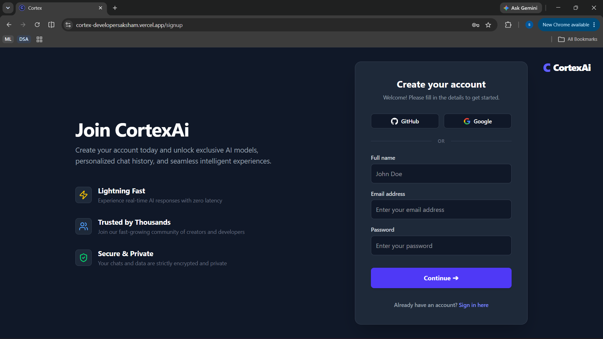

<div align="center">

# Cortex

**A multi-agent AI workspace for conversation, retrieval-augmented document Q&A, code generation, and live web search.**

[](http://cortex-developersaksham.vercel.app/)
[](#license)
[](#prerequisites)
[](#tech-stack)
[](#tech-stack)

[Live Demo](http://cortex-developersaksham.vercel.app/) · [Repository](https://github.com/Saksham-A-garwal/Cortex) · [Report Bug](https://github.com/Saksham-A-garwal/Cortex/issues) · [Request Feature](https://github.com/Saksham-A-garwal/Cortex/issues)

</div>

---

## Table of Contents

1. [Overview](#overview)
2. [Key Features](#key-features)
3. [Screenshots](#screenshots)
4. [Architecture](#architecture)
5. [Tech Stack](#tech-stack)
6. [Getting Started](#getting-started)
   - [Prerequisites](#prerequisites)
   - [Installation](#installation)
   - [Configuration](#configuration)
   - [Running Locally](#running-locally)
7. [Deployment](#deployment)
8. [Project Structure](#project-structure)
9. [Backend Details](#backend-details)
10. [Frontend Details](#frontend-details)
11. [Environment Variables](#environment-variables)
12. [Known Limitations / Roadmap](#known-limitations--roadmap)
13. [Contributing](#contributing)
14. [License](#license)

---

## Overview

Cortex is a full-stack AI workspace where every request is routed through a **LangGraph-based multi-agent graph** rather than handled by a single general-purpose model. A lightweight router classifies each incoming message and dispatches it to the specialist agent best equipped to handle it — general conversation, code generation, live web search, or retrieval-augmented document Q&A — so each task is served by a model and pipeline sized to its complexity.

With Cortex, users can:

- **Converse** with a general-purpose conversational agent.
- **Upload PDF or plain-text documents**, have them chunked and embedded, and ask context-aware questions grounded in that content (RAG).
- **Generate, debug, and refactor code** through a dedicated coding agent.
- **Run live web searches** for up-to-date, real-world information via Tavily.
- **Authenticate securely** using email/password or Google/GitHub OAuth 2.0.

**[→ Try the live demo](http://cortex-developersaksham.vercel.app/)**

---

## Key Features

| Feature | Description |
|---|---|
| **Multi-agent architecture** | A router agent classifies each message and dispatches it to a General, Coding, Search, or RAG agent via LangGraph |
| **Cost/latency-aware model selection** | Each agent uses a model sized to its task — a fast/cheap model for routing, stronger reasoning models for coding and RAG |
| **OAuth 2.0 authentication** | Google and GitHub sign-in via Passport, alongside standard email/password auth |
| **Real-time streaming** | Responses stream token-by-token over Server-Sent Events instead of returning as a single blob |
| **Retrieval-Augmented Generation (RAG)** | PDF/TXT ingestion → chunking → embeddings → Qdrant vector store, fully scoped per user |
| **Query reformulation** | Before retrieval, an LLM rewrites vague prompts (e.g. *"summarize this"*) into a precise vector-search query using the user's recent uploads as context |
| **Graceful RAG fallback** | Automatically falls back to an in-memory keyword retriever if Qdrant or embedding credentials aren't configured, so local development works out of the box |
| **File upload & preview** | Uploaded PDFs appear as interactive chips with an in-app preview modal |
| **Chat history filter** | Sidebar search modal filters chats already loaded on the client |
| **Streamlined install** | `.npmrc` sets `legacy-peer-deps=true` to avoid LangChain peer-dependency conflicts |

---

## Screenshots

### Authentication

<table>
<tr>
<td width="50%">

**Sign In**


</td>
<td width="50%">

**Sign Up**


</td>
</tr>
</table>

Email/password and Google/GitHub OAuth 2.0 are both supported on a single, unified auth screen.

### Workspace Home


The landing view inside the workspace, with quick-start prompts and the persistent chat sidebar.

### General Conversation


The **General agent** handling an open-ended question, rendered with full markdown support — headings, bold text, and comparison tables.

### Coding Agent


The **Coding agent** generating a syntax-highlighted, documented Python function, with a copy-to-clipboard action on the code block.

### Retrieval-Augmented Generation (RAG)

**1. Document Upload**


**2. Grounded Answer**


A PDF is uploaded, chunked, and embedded into Qdrant. The **RAG agent** then reformulates the user's question, retrieves the most relevant chunks scoped to that document, and returns an answer grounded in its actual content.

### Live Web Search


The **Search agent** calling the Tavily tool for current, real-world information and summarizing the results back to the user.

### Chat History Search


The sidebar's search modal filters conversations already loaded in client state for quick navigation back to a previous chat.

---

## Architecture

### Agent Orchestration

```
                        ┌──────────────┐
   User message ──────► │  Router Node │
                        └──────┬───────┘
                               │ classifies intent
              ┌────────────────┼────────────────┬───────────────┐
              ▼                ▼                 ▼               ▼
        ┌───────────┐   ┌────────────┐    ┌────────────┐  ┌─────────────┐
        │  General  │   │   Coding   │    │    RAG     │  │   Search    │
        │   Agent   │   │   Agent    │    │   Agent    │  │   Agent     │
        └─────┬─────┘   └─────┬──────┘    └─────┬──────┘  └──────┬──────┘
              │               │                 │                │
              │               │                 │         ┌──────▼──────┐
              │               │                 │         │ Tavily Tool │
              │               │                 │         │   (search)  │
              │               │                 │         └──────┬──────┘
              │               │                 │                │ loops back
              ▼               ▼                 ▼                ▼
             END             END               END          Search Agent
                                                              (summarizes results)
```

### System Overview

```
┌───────────────────────┐   SSE (text/event-stream)   ┌───────────────────────────┐
│    Frontend (React)    │◄────────────────────────────►│  Backend (Node/Express)   │
│  • Chat UI              │                              │  • authRoutes             │
│  • File upload          │                              │  • chatsRoutes            │
│  • Chat history filter  │                              │  • MessageRoutes          │
└───────────┬─────────────┘                              │  • documentRoutes         │
            │                                             │  • userRoutes             │
            ▼                                             └────────────┬──────────────┘
   ┌────────────────┐                                                  │
   │   Passport.js   │                                                 ▼
   │ (Google/GitHub) │                                      ┌───────────────────────┐
   └────────┬─────────┘                                     │    LangGraph Graph     │
            ▼                                                │  Router → General /    │
   ┌─────────────────────┐                                   │  Coding / Search / RAG │
   │ Session + JWT auth   │                                  └────────────┬────────────┘
   └─────────────────────┘                                                │
                                                                ┌──────────▼───────────┐
                                                                │  Qdrant Vector Store  │
                                                                │  (Gemini embeddings)  │
                                                                └───────────────────────┘
```

---

## Tech Stack

| Layer | Technology |
|---|---|
| **Frontend** | React 19 + Vite · Redux Toolkit · Tailwind CSS 4 · `react-markdown` (+ `remark-gfm`, `rehype-katex`) · `react-syntax-highlighter` · `@microsoft/fetch-event-source` |
| **Backend** | Node.js · Express 5 · `dotenv` · `express-session` · `passport` · `cors` · `multer` |
| **Database** | MongoDB + Mongoose (users, chats, messages, document metadata) |
| **Vector Store** | Qdrant, with an in-memory fallback for local development |
| **LLM Providers** | Groq (Llama 3.1 / 3.3) · OpenRouter (DeepSeek R1 / DeepSeek Chat) · Google Gemini (embeddings) |
| **Orchestration** | LangGraph (`@langchain/langgraph`) |
| **Search Tool** | Tavily |
| **Authentication** | Email/password (JWT) · Google OAuth 2.0 · GitHub OAuth 2.0 (`passport-google-oauth20`, `passport-github2`) |
| **Deployment** | Render (backend) · Vercel (frontend) |
| **Package Manager** | npm — `.npmrc` sets `legacy-peer-deps=true` |

---

## Getting Started

### Prerequisites

- **Node.js** 18 or later
- **npm**
- A **MongoDB** instance (local or Atlas)
- API keys for the providers you intend to use — see [Environment Variables](#environment-variables)
- A **Qdrant** instance *(optional — omit to use the in-memory fallback locally)*

### Installation

```bash
git clone https://github.com/Saksham-A-garwal/Cortex.git
cd Cortex

cd Backend && npm install    # .npmrc already sets legacy-peer-deps, no extra flag needed
cd ../Frontend && npm install
```

### Configuration

Create a `.env` file inside `Backend/` — see [Environment Variables](#environment-variables) for the full list. If a `.env.example` is present, copy it as a starting point:

```bash
cd Backend
cp .env.example .env
# fill in the values described below
```

The frontend reads its backend URL from Vite's environment variables, e.g. in `Frontend/.env`:

```env
VITE_BACKEND_URL=http://localhost:5000
```

### Running Locally

```bash
# Terminal 1 — Backend
cd Backend
npm run dev     # nodemon, defaults to http://localhost:5000

# Terminal 2 — Frontend
cd Frontend
npm run dev     # Vite dev server, defaults to http://localhost:5173
```

Open **http://localhost:5173** to reach the login page. After signing in (email/password or OAuth), you'll land in the chat workspace.

---

## Deployment

### Backend — Render

| Step | Value |
|---|---|
| Service type | Web Service |
| Root directory | `Backend` |
| Build command | `npm install` |
| Start command | `node server.js` |
| Environment variables | See [table below](#environment-variables) |

Render picks up `.npmrc` automatically, so LangChain peer-dependency install issues are handled without extra flags.

### Frontend — Vercel

1. Import the repository into Vercel and set **Root Directory** to `Frontend`.
2. Add the environment variable `VITE_BACKEND_URL`, pointing to your deployed backend (e.g. `https://cortex-backend.onrender.com`).
3. Deploy. For explicit client-side routing rewrites with React Router, add a `vercel.json`:

```json
{
  "rewrites": [{ "source": "/(.*)", "destination": "/index.html" }]
}
```

**Live production deployment:** [cortex-developersaksham.vercel.app](http://cortex-developersaksham.vercel.app/)

---

## Project Structure

```
Cortex/
├─ Backend/
│  ├─ Agents/
│  │  ├─ graph.js              # LangGraph entry point — wires all agent nodes together
│  │  ├─ modelConfig.js        # Per-agent LLM provider/model configuration
│  │  ├─ State.js              # Shared LangGraph state definition
│  │  ├─ Nodes/
│  │  │  ├─ routerNode.js
│  │  │  ├─ generalNode.js
│  │  │  ├─ codingNode.js
│  │  │  ├─ searchNode.js
│  │  │  └─ ragNode.js
│  │  └─ Prompts/               # System prompts per agent
│  ├─ Controllers/
│  │  ├─ authControllers.js
│  │  ├─ chatControllers.js
│  │  ├─ documentControllers.js
│  │  ├─ MessageControllers.js  # includes the SSE streaming handler
│  │  └─ userControllers.js
│  ├─ Routers/
│  │  ├─ authRoutes.js
│  │  ├─ chatsRoutes.js
│  │  ├─ MessageRoutes.js
│  │  ├─ documentRoutes.js
│  │  └─ userRoutes.js
│  ├─ Services/
│  │  ├─ authServices.js
│  │  ├─ documentService.js     # PDF/TXT text extraction
│  │  └─ qdrantService.js       # Vector store read/write, with in-memory fallback
│  ├─ Config/
│  │  └─ Passport.js            # Google & GitHub OAuth strategies
│  ├─ Model/
│  │  ├─ UserModel.js
│  │  ├─ ChatModel.js
│  │  ├─ MessageModel.js
│  │  └─ DocumentModel.js
│  ├─ middleware/
│  │  └─ authmiddleware.js      # Bearer-token auth guard for API routes
│  ├─ server.js
│  └─ .npmrc                    # legacy-peer-deps=true
└─ Frontend/
   ├─ src/
   │  ├─ Components/
   │  │  ├─ ChatInput.jsx       # Message input, file upload, PDF preview trigger
   │  │  ├─ ChatArea.jsx
   │  │  ├─ MessageBubble.jsx
   │  │  ├─ CodeBlock.jsx       # Syntax-highlighted code rendering
   │  │  ├─ SearchModal.jsx     # Client-side chat history filter
   │  │  └─ Sidebar.jsx
   │  ├─ Layout/
   │  │  ├─ DashboardLayout.jsx
   │  │  └─ ProtectedRoute.jsx
   │  ├─ Pages/
   │  │  ├─ ChatPage.jsx
   │  │  ├─ LoginPage.jsx
   │  │  ├─ SignupPage.jsx
   │  │  ├─ ProfilePage.jsx
   │  │  ├─ SettingsPage.jsx
   │  │  ├─ OAuthCallback.jsx
   │  │  └─ NotFoundPage.jsx
   │  ├─ Context/
   │  │  └─ AuthContext.jsx
   │  ├─ App.jsx
   │  └─ main.jsx
   ├─ public/
   │  ├─ favicon.svg
   │  └─ icons.svg
   ├─ index.html
   └─ vite.config.js
```

---

## Backend Details

### Server & Routing

- `server.js` boots Express, configures CORS, sessions (for the OAuth handshake), and Passport.
- All API endpoints live under `/api/` — `/api/auth`, `/api/chats`, `/api/messages`, `/api/documents`, `/api/users`.
- Routes are intentionally thin; business logic lives in `Controllers/`.

### Authentication

Cortex uses two distinct mechanisms for two distinct purposes:

- **Session-based** (via `express-session` + Passport) — used *only* during the Google/GitHub OAuth handshake.
- **JWT Bearer tokens** — used to authenticate subsequent API requests. `authmiddleware.js` reads the `Authorization: Bearer <token>` header and verifies it via `authServices.js`.

> **Note:** the JWT signing secret (`JWT_SECRET_KEY`) and the Express session secret (`JWT_SECRET`) are two distinct environment variables — don't conflate them when configuring your `.env`.

### Document Processing & RAG Pipeline

| Step | Detail |
|---|---|
| 1. Upload | `multer` stores the file in memory (10 MB limit, PDF/TXT only) |
| 2. Extraction | `documentService.js` extracts raw text via `pdf-parse` for PDFs, or reads plain text directly |
| 3. Chunking | `RecursiveCharacterTextSplitter` — 1000-character chunks, 150-character overlap |
| 4. Embedding | Google Generative AI embeddings (`gemini-embedding-001`) |
| 5. Storage | `qdrantService.js` writes chunks to Qdrant with metadata (`ownerId`, `documentId`, `filename`, `chunkIndex`). Falls back to an in-memory keyword-overlap store if Qdrant or the embeddings key isn't configured |
| 6. Retrieval | `ragNode.js` reformulates the user's question into a sharper search query (using their recent upload list as context), retrieves the top matches scoped to their `ownerId`, and generates a grounded answer with inline source citations |

### Multi-Agent Orchestration (LangGraph)

- **Router agent** (`routerNode.js`) — classifies intent into `general`, `coding`, `search`, or `rag` using Zod-validated structured output; fenced code blocks skip classification and go straight to the coding agent.
- **General agent** — open-ended conversation.
- **Coding agent** — code generation, debugging, and refactoring.
- **Search agent** — calls the Tavily tool for live web results, then loops back to summarize them.
- **RAG agent** — retrieves and answers from the user's uploaded documents.

### Vector Store (Qdrant)

- `qdrantService.js` handles indexing, similarity search, and deletion, scoped per user via metadata filters.
- Falls back transparently to an in-memory store when Qdrant isn't reachable or configured, so the RAG pipeline remains fully functional in local development without extra setup.

---

## Frontend Details

### UI Components

| Component | Purpose |
|---|---|
| `ChatInput.jsx` | Message input and file upload; uploaded files render as chips with a click-to-preview PDF modal |
| `ChatArea.jsx` / `MessageBubble.jsx` / `CodeBlock.jsx` | Conversation rendering, including markdown, LaTeX, and syntax-highlighted code |
| `Sidebar.jsx` | Navigation and entry point to `SearchModal` |
| `SearchModal.jsx` | Filters chats already loaded in client state — a UI convenience, not a backend search query |
| `DashboardLayout.jsx` | Authenticated app shell |

### File Upload & Preview

- Accepts `application/pdf` and `text/plain`, up to 10 MB.
- Files are sent as `multipart/form-data` to `POST /api/documents/upload`.
- Returned metadata is stored in client state and rendered as an interactive chip; PDFs preview via `URL.createObjectURL` in an `<iframe>`.

### Streaming

- `POST /api/messages` streams the model's response back over `text/event-stream`, consumed on the client with `@microsoft/fetch-event-source`.
- An `AbortController` cancels the stream when a conversation ends or the component unmounts.

### Styling

- Dark-themed UI built with Tailwind CSS, using the Inter font.
- Custom favicon and page title.

---

## Environment Variables

| Variable | Required | Description |
|---|:---:|---|
| `PORT` | No *(defaults to `5000`)* | Backend listening port |
| `FRONTEND_URL` | Yes | Used for CORS and OAuth redirect fallback |
| `MONGO_URI` | Yes | MongoDB connection string |
| `JWT_SECRET` | Yes | Express session secret (used during the OAuth handshake) |
| `JWT_SECRET_KEY` | Yes | Secret used to sign/verify API JWTs |
| `GOOGLE_CLIENT_ID` / `GOOGLE_CLIENT_SECRET` | For Google OAuth | Google OAuth app credentials |
| `GITHUB_CLIENT_ID` / `GITHUB_CLIENT_SECRET` | For GitHub OAuth | GitHub OAuth app credentials |
| `GROQ_API_KEY` | Yes | Groq API key (router/general/RAG models) |
| `OPENROUTER_API_KEY` | Yes | OpenRouter API key (coding/search models) |
| `GEMINI_API_KEY` / `GOOGLE_API_KEY` | Yes | Google Generative AI key, used for embeddings |
| `TAVILY_API_KEY` | Yes | Tavily API key for the search agent |
| `QDRANT_URL` | No | Qdrant instance URL — omit to use the in-memory fallback |
| `QDRANT_API_KEY` | No | Qdrant API key, if your instance requires one |
| `QDRANT_COLLECTION` | No *(defaults to `cortex_documents`)* | Qdrant collection name |
| `VITE_BACKEND_URL` *(Frontend)* | Yes | Base URL the frontend uses to call the backend API |

---

## Known Limitations / Roadmap

- [ ] No automated test suite is currently committed to the repository.
- [ ] Authentication mixes session-based and JWT-based flows for different purposes (see [Authentication](#authentication)) — worth consolidating as the project matures.
- [ ] Expand deployment documentation with monitoring/observability guidance.

---

## Contributing

Contributions are welcome. To get started:

1. **Fork** the repository.
2. **Create a feature branch:**
   ```bash
   git checkout -b feat/<description>
   ```
3. **Follow the existing code style** — ESLint is configured on the frontend.
4. **Open a pull request** with a clear description of the change and a reference to any related issue.

> File and folder names follow the existing casing conventions in the repo — please match them to avoid case-sensitivity issues on Linux-based deployments.

---

## License

No `LICENSE` file is currently included in this repository. Add one (e.g. MIT) before treating this project as open source, or state your intended terms here.

---

<div align="center">

Built by [Saksham Agarwal](https://github.com/Saksham-A-garwal)

</div>
